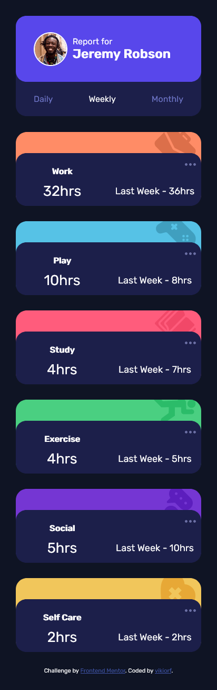

# Frontend Mentor - Time tracking dashboard solution

This is a solution to the [Time tracking dashboard challenge on Frontend Mentor](https://www.frontendmentor.io/challenges/time-tracking-dashboard-UIQ7167Jw). Frontend Mentor challenges help you improve your coding skills by building realistic projects.

## Table of contents

- [Overview](#overview)
  - [The challenge](#the-challenge)
  - [Screenshot](#screenshot)
  - [Links](#links)
- [My process](#my-process)
  - [Built with](#built-with)
  - [What I learned](#what-i-learned)
  - [Continued development](#continued-development)


## Overview

### The challenge

Users should be able to:

- View the optimal layout for the site depending on their device's screen size
- See hover states for all interactive elements on the page
- Switch between viewing Daily, Weekly, and Monthly stats

### Screenshot



### Links

- Live Site URL: [Add live site URL here](https://time-tracker-frontend-mentor.vercel.app/)

## My process

### Built with

- Semi-Semantic HTML5 markup
- CSS custom properties
- Flexbox
- CSS Grid
- Mobile-first workflow

### What I learned

How I can use background-image along with background-position to my advantage.
Below is a demonstration where I set the background image seperately and position the image in the shown class.

```css
.activity-image {
  background-origin: border-box;
  background-position: top -10px right 10px;
  background-repeat: no-repeat;
  position: absolute;
  height: 65px;
  opacity: 0.9;
  width: 100px;
  z-index: 1;
}
```

### Continued development

I'm still very new to web development, but I think as far as a first project goes, this was great.
I should get better at semantic markup.
